# Kite Trading Recommendation App - Architecture Diagram

## System Overview

The Kite Trading Recommendation App is a sophisticated trading analysis and recommendation system designed for Indian stock markets. It combines real-time portfolio data, market sentiment analysis, and professional-grade recommendations to help traders make informed decisions while managing risk and portfolio diversification.

## Architecture Components

```mermaid
graph TB
    %% External Systems
    subgraph "External Systems"
        KITE[Kite Trading Platform]
        SCREENER[Screener.in]
        SMART_INV[Smart-Investing.in]
        TICKERTAPE[Tickertape.in]
        STOCKEDGE[StockEdge.com]
        NEWS[News APIs]
    end

    %% MCP Server (Existing)
    subgraph "MCP Server (Existing)"
        MCP_SERVER[MCP Server]
        KITE_CONNECT[KiteConnect SDK]
        MCP_TOOLS[MCP Tools]
        MCP_PROMPTS[MCP Prompts]
        MCP_RESOURCES[MCP Resources]
    end

    %% TradingInsight Application
    subgraph "TradingInsight Application"
        %% UI Layer
        subgraph "UI Layer (Streamlit)"
            MAIN_UI[Main UI]
            PORTFOLIO_UI[Portfolio View]
            ANALYSIS_UI[Analysis View]
            RECOMMENDATION_UI[Recommendation View]
            SETTINGS_UI[Settings View]
        end

        %% Service Layer
        subgraph "Service Layer"
            MCP_CLIENT[MCP Client]
            PORTFOLIO_SERVICE[Portfolio Service]
            ANALYSIS_SERVICE[Analysis Service]
            RECOMMENDATION_SERVICE[Recommendation Service]
        end

        %% Agent Layer
        subgraph "Agent Layer"
            MARKET_ANALYST[Market Analyst Agent]
            RECOMMENDATION_AGENT[Recommendation Agent]
        end

        %% Model Layer
        subgraph "Model Layer"
            PORTFOLIO_MODELS[Portfolio Models]
            ANALYSIS_MODELS[Analysis Models]
            RECOMMENDATION_MODELS[Recommendation Models]
        end

        %% Config Layer
        subgraph "Config Layer"
            SETTINGS[Application Settings]
            STOCK_SCOPE[Stock Scope List]
            FILTERS[Filter Constraints]
        end
    end

    %% Data Flow
    KITE --> MCP_SERVER
    MCP_SERVER --> MCP_CLIENT
    MCP_CLIENT --> PORTFOLIO_SERVICE
    MCP_CLIENT --> ANALYSIS_SERVICE
    MCP_CLIENT --> RECOMMENDATION_SERVICE

    %% External Data Sources
    SCREENER --> MARKET_ANALYST
    SMART_INV --> MARKET_ANALYST
    TICKERTAPE --> MARKET_ANALYST
    STOCKEDGE --> MARKET_ANALYST
    NEWS --> MARKET_ANALYST

    %% Service Connections
    PORTFOLIO_SERVICE --> PORTFOLIO_UI
    ANALYSIS_SERVICE --> ANALYSIS_UI
    RECOMMENDATION_SERVICE --> RECOMMENDATION_UI
    SETTINGS --> SETTINGS_UI

    %% Agent Connections
    MARKET_ANALYST --> ANALYSIS_SERVICE
    RECOMMENDATION_AGENT --> RECOMMENDATION_SERVICE

    %% Model Connections
    PORTFOLIO_MODELS --> PORTFOLIO_SERVICE
    ANALYSIS_MODELS --> ANALYSIS_SERVICE
    RECOMMENDATION_MODELS --> RECOMMENDATION_SERVICE

    %% Config Connections
    STOCK_SCOPE --> RECOMMENDATION_AGENT
    FILTERS --> RECOMMENDATION_AGENT
    SETTINGS --> MAIN_UI

    %% UI Connections
    MAIN_UI --> PORTFOLIO_UI
    MAIN_UI --> ANALYSIS_UI
    MAIN_UI --> RECOMMENDATION_UI
    MAIN_UI --> SETTINGS_UI
```

## Detailed Component Architecture

### 1. External Systems Layer

#### **Kite Trading Platform**
- **Purpose**: Primary data source for portfolio and market data
- **Integration**: Via existing MCP server using KiteConnect SDK
- **Data**: Portfolio positions, margins, cash, option chains, market data

#### **Financial Data Sources**
- **Screener.in**: Quarterly financial results and fundamental analysis
- **Smart-Investing.in**: Stock intrinsic value analysis
- **SimplyWall.st**: Additional intrinsic value data
- **Tickertape.in**: Analyst ratings and market mood index
- **StockEdge.com**: FII activity and institutional sentiment
- **News APIs**: Real-time news and social media sentiment

### 2. MCP Server Layer (Existing)

#### **MCP Server**
- **Status**: Existing, unmodified
- **Purpose**: Bridge between Kite platform and TradingInsight application
- **Components**:
  - **KiteConnect SDK**: Authentication and data retrieval
  - **MCP Tools**: Portfolio, market indicators, option chains
  - **MCP Prompts**: Analysis templates
  - **MCP Resources**: Market knowledge and data

### 3. TradingInsight Application Layer

#### **UI Layer (Streamlit)**
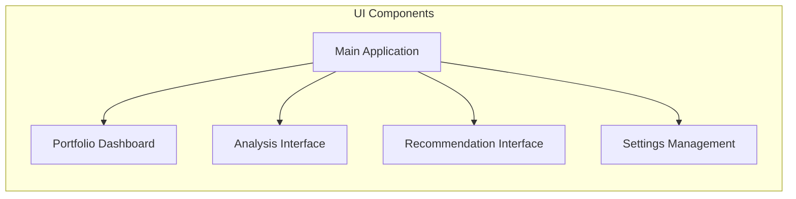

**Components**:
- **Main UI**: Application entry point and navigation
- **Portfolio View**: Sector grouping, position metrics, risk indicators
- **Analysis View**: Market sentiment, custom prompts, confidence scores
- **Recommendation View**: Trade opportunities, filters, action points
- **Settings View**: Stock scope, filter constraints, configuration

#### **Service Layer**
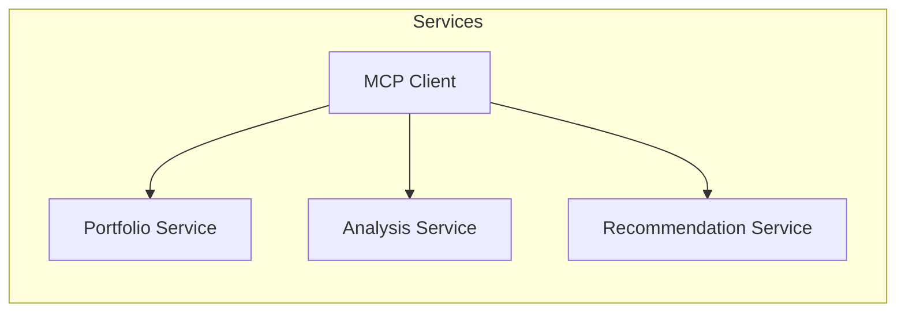

**Components**:
- **MCP Client**: Connection to existing MCP server
- **Portfolio Service**: Data processing, metrics calculation (ROM, SSR, RI)
- **Analysis Service**: Market analyst integration, sentiment analysis
- **Recommendation Service**: Trade identification, filtering, validation

#### **Agent Layer**
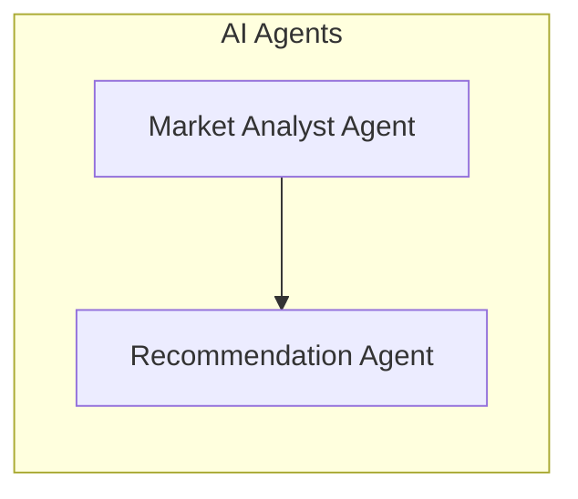

**Components**:
- **Market Analyst Agent**: Professional equity research analyst
  - Short-term analysis (<1 month)
  - Medium-term analysis (1-3 months)
  - Financial results analysis
  - Intrinsic value assessment
  - Social sentiment analysis
  - Confidence scoring (1-10 scale)

- **Recommendation Agent**: Investment fund manager
  - Options chain analysis
  - Trade identification (new/swap/hedge)
  - Portfolio optimization
  - Risk-reward calculations
  - Self-review and improvement

#### **Model Layer**
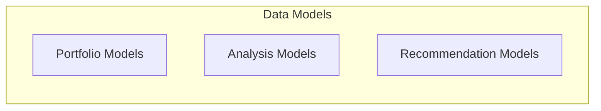

**Components**:
- **Portfolio Models**: Position, Portfolio, sector exposure
- **Analysis Models**: SentimentAnalysis with financial data
- **Recommendation Models**: TradeRecommendation with reasoning

#### **Config Layer**
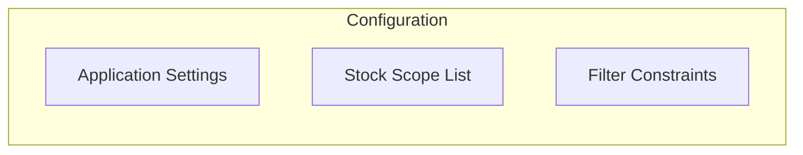

**Components**:
- **Application Settings**: General configuration
- **Stock Scope List**: Approved stocks for analysis
- **Filter Constraints**: SSR, premium, ROM, risk thresholds

## Data Flow Architecture

### 1. Portfolio Data Flow
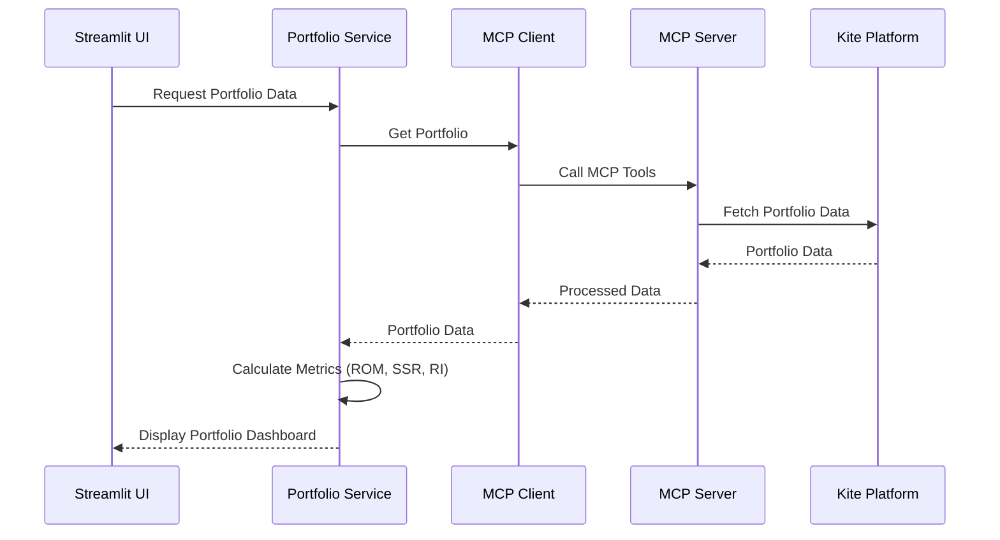

### 2. Market Analysis Flow
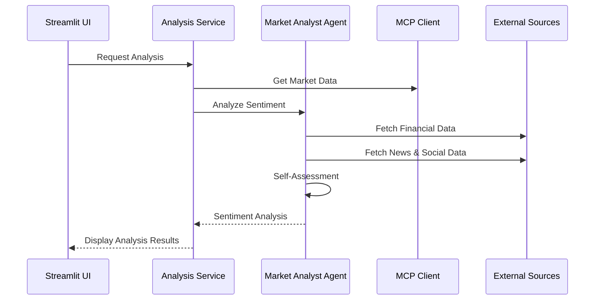

### 3. Recommendation Flow
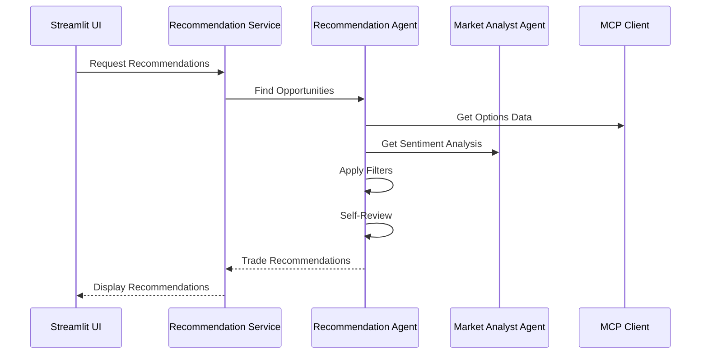

## Key Metrics and Calculations

### Trading Indicators
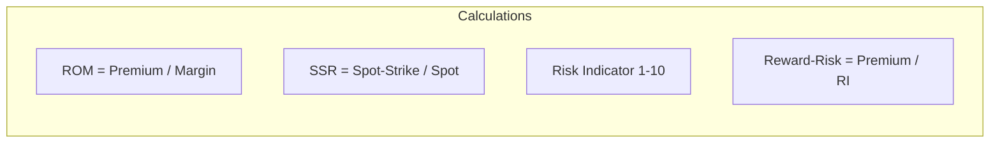

### Risk Management
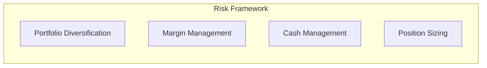

## Technology Stack

### Frontend
- **Streamlit**: Web-based UI framework
- **Session State**: User preferences and data persistence
- **Real-time Updates**: Live portfolio and market data

### Backend
- **Python**: Core application language
- **PydanticAI**: Structured data validation and LLM integration
- **LangGraph**: Complex LLM workflows and agent orchestration
- **Async/Await**: Non-blocking operations for external APIs

### External Integrations
- **KiteConnect SDK**: Trading platform integration
- **Web Scraping**: Financial data from multiple sources
- **LLM APIs**: Advanced analysis and recommendations

### Data Models
- **Pydantic Models**: Type-safe data structures
- **Validation**: Input/output data validation
- **Serialization**: MCP communication protocols

## Security and Compliance

### Indian Market Compliance
- **Trading Hours**: 9:15 AM - 3:30 PM IST
- **Options Expiry**: Last Thursday of every month
- **Regulations**: SEBI compliance and market rules

### Data Security
- **Authentication**: Kite platform authentication
- **Rate Limiting**: API call throttling
- **Error Handling**: Graceful failure management

## Scalability Considerations

### Performance
- **Caching**: Portfolio and analysis data caching
- **Async Operations**: Non-blocking external API calls
- **Session Management**: Efficient state management

### Extensibility
- **Modular Design**: Service-based architecture
- **Plugin System**: Easy addition of new data sources
- **Configuration**: Flexible settings management

## Monitoring and Logging

### Application Monitoring
- **Error Tracking**: Comprehensive error logging
- **Performance Metrics**: Response time monitoring
- **User Analytics**: Feature usage tracking

### Trading Metrics
- **Portfolio Performance**: ROI, risk metrics
- **Recommendation Accuracy**: Success rate tracking
- **Market Analysis Quality**: Confidence score validation

This architecture provides a robust, scalable, and maintainable foundation for the Kite Trading Recommendation App, ensuring all requirements from the FeatureRequirement.md are met while maintaining clean separation of concerns and professional-grade implementation standards. 